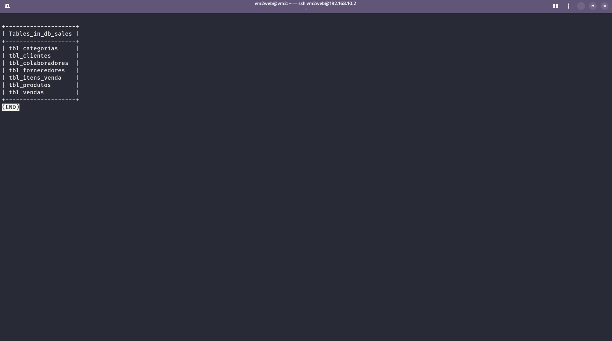
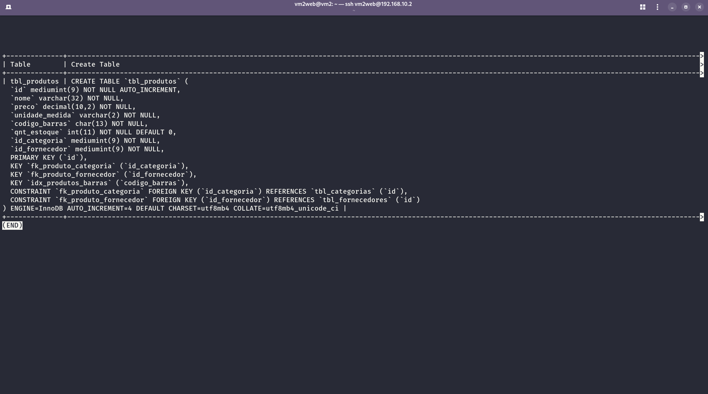
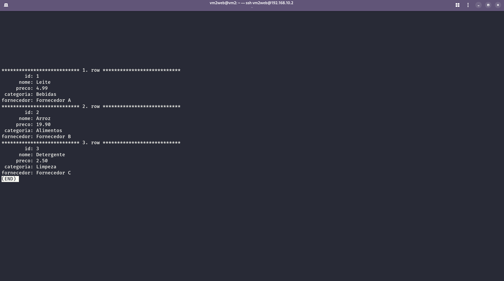
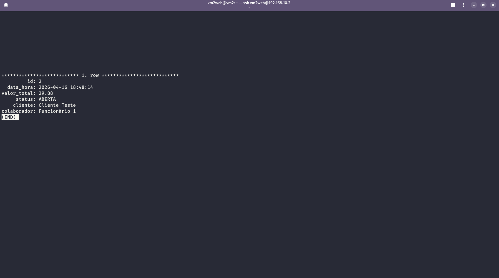
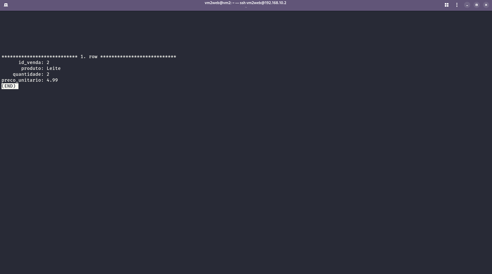
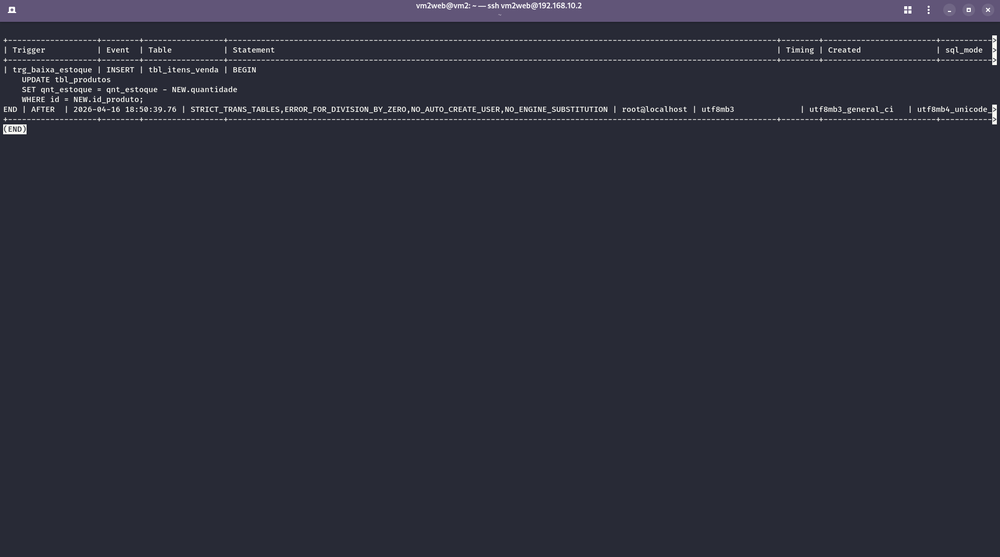
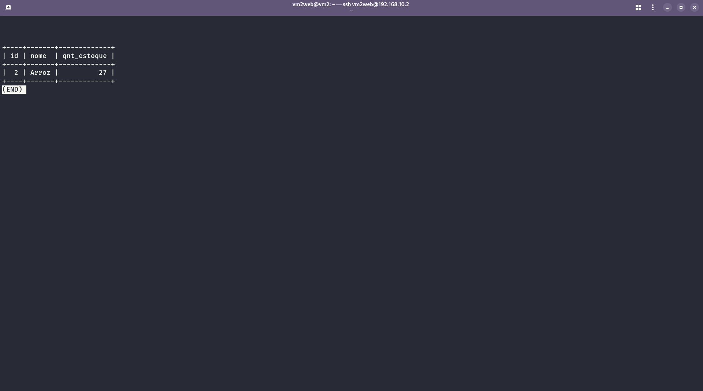
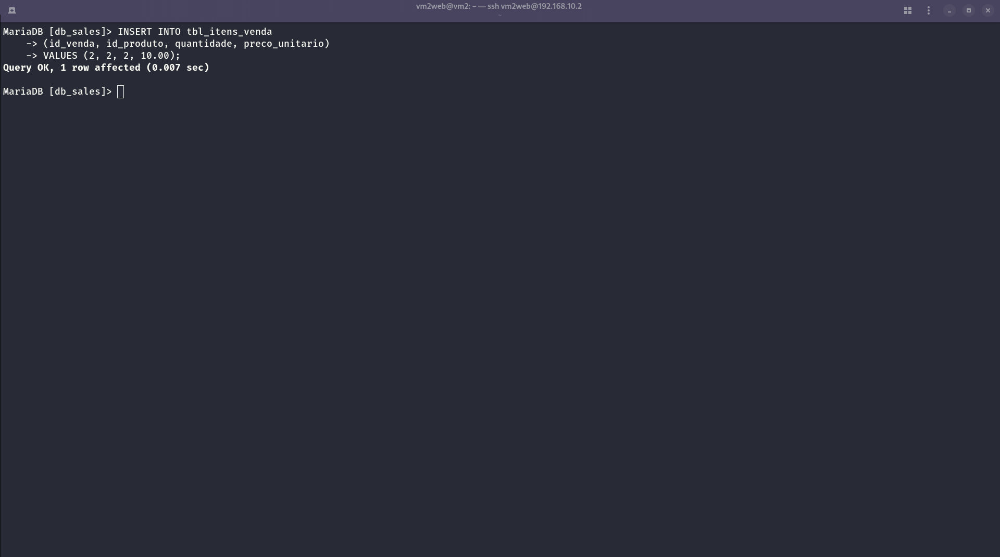
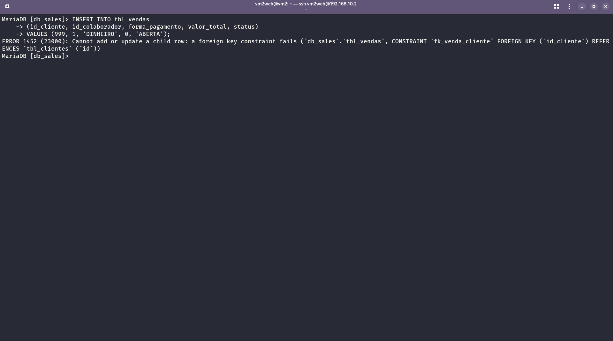

# Supermarket Sales Database

Relational database system for a supermarket sales operation — designed, implemented, and deployed on a Linux VM as part of an academic project.

---

## Overview

This project models and implements a complete sales database for a retail environment. The system handles customers, employees, products, categories, suppliers, sales transactions, and stock management — including automated stock reduction via database trigger.

The database was deployed on the **MariaDB instance running on `vm2web`**, part of the [enterprise-linux-lab](https://github.com/reisops/enterprise-linux-lab) infrastructure. The web server VM already had MariaDB configured as part of the multi-service Linux environment, so this project was built directly on top of that infrastructure.

---

## Schema

7 tables, fully normalized:

| Table | Description |
|---|---|
| `tbl_clientes` | Customer records with loyalty program fields |
| `tbl_colaboradores` | Employee records with role and status tracking |
| `tbl_produtos` | Product catalog with stock quantity and barcode |
| `tbl_categorias` | Product category classification |
| `tbl_fornecedores` | Supplier contact information |
| `tbl_vendas` | Sales transactions linked to customer and employee |
| `tbl_itens_venda` | Line items per sale — resolves the N:M relationship between sales and products |

### Logical Diagram

.png)

### Entity Relationships

```
tbl_clientes ──────────┐
                       ├──► tbl_vendas ──► tbl_itens_venda ──► tbl_produtos ──► tbl_categorias
tbl_colaboradores ─────┘                                             └──────────► tbl_fornecedores
```

---

## Key Design Decisions

**N:M Resolution**
A sale can contain multiple products, and a product can appear in multiple sales. This many-to-many relationship is resolved through `tbl_itens_venda`, which stores the unit price at the time of purchase — preserving historical pricing even if the product price changes later.

**Stock Automation**
A trigger (`trg_baixa_estoque`) fires automatically after each INSERT into `tbl_itens_venda`, reducing `qnt_estoque` in `tbl_produtos` by the purchased quantity. Stock management is handled at the database level, independent of the application layer.

```sql
AFTER INSERT ON tbl_itens_venda
UPDATE tbl_produtos
SET qnt_estoque = qnt_estoque - NEW.quantidade
WHERE id = NEW.id_produto;
```

**Referential Integrity**
Foreign key constraints enforced with InnoDB. Attempting to insert a sale referencing a non-existent customer raises `ERROR 1452` — the database rejects invalid data at the engine level.

---

## Evidence

### Tables



### Table Structure



### JOIN Query — Products with category and supplier



### Sale with customer and employee



### Sale line item



### Trigger registered



### Trigger validation — stock before purchase



### INSERT into tbl_itens_venda



### Stock after trigger fires (27 → 25)


### Referential integrity — FK constraint blocking invalid insert



---

## Infrastructure

- **Database:** MariaDB (InnoDB engine, utf8mb4 charset)
- **Host:** Ubuntu Server 24.04 — `vm2web` inside a multi-VM VirtualBox lab
- **Connection:** SSH from Fedora host → vm2web → MariaDB CLI
- **Related project:** [enterprise-linux-lab](https://github.com/reisops/enterprise-linux-lab)

---

## Files

| File | Description |
|---|---|
| `sql/db_sales.sql` | Full database dump — schema + data |
| `diagrams/db_sales(1).png` | Logical diagram |
| `screenshots/` | Evidence of implementation and testing |
| `README.md` | This file |

---

## Related Projects

- [enterprise-linux-lab](https://github.com/reisops/enterprise-linux-lab) — multi-VM Linux infrastructure where this database was deployed. The MariaDB instance running on `vm2web` served as the backend for this project.

---

## Academic Context

Developed as a practical assignment for the Cloud Computing technologist program at UniFECAF. The implementation went beyond the basic requirements by adding automated stock control via trigger, composite unique constraints, and historical price preservation in transaction line items.

---

*Part of the [reisops](https://github.com/reisops) infrastructure portfolio.*
